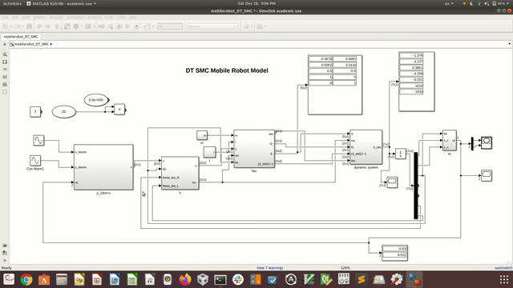

#  Design of Sliding Mode Controller for Two-wheeled Mobile Robot - Path Tracking
---

## What is Sliding Mode Control(SMC) ?
Sliding mode control (SMC) is a nonlinear control technique featuring remarkable properties of accuracy, robustness, and easy tuning and implementation.SMC systems are designed to drive the system states onto a particular surface in the state space, named sliding surface. Once the sliding surface is reached, sliding mode control keeps the states on the close neighbourhood of the sliding surface.Hence the sliding mode control is a two part controller design. The first part involves the design of a sliding surface so that the sliding motion satisfies design specifications. The second is concerned with the selection of a control law that will make the switching surface attractive to the system state .

---

## Dependencies
- __Matlab and Simulink__
---

## SMC in action

Note - The SMC controller is not working perfectly as expected .  

## Simulation Results of SMC 
 
 

---
- The detailed description about the project can be found [here](https://drive.google.com/open?id=0B6cvaukIjPj5NUVWb0lETkVGZWhBT2pCNEo1Mm1sM0hxSnY4)

---
### References -
1.S.Chakrabarty and B. Bandyopadhyay , “Minimum Ultimate Band Design of Discrete Sliding Mode Control” , Asian journal of control 17 (5), pp. 1889-1897 , 2015   
2.Paulo Coelho and Urbano Nunes , “ Path-Following Control of Mobile Robots in Presence of Uncertainties “ IEEE Transactions on Robotics , VOL 21 (2) ,pp. 252-261 , 2005
